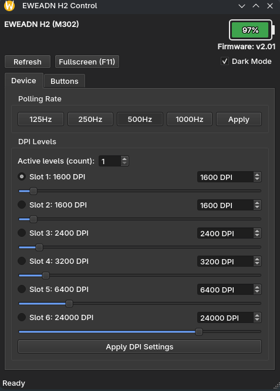

# EWEADN H2 Control

A small Linux GUI for the **EWEADN H2** wireless mouse — shows battery
percentage, firmware version, and lets you change the USB polling rate
and all 6 DPI levels, without needing the official web driver.

Built because the H2 has no native Linux driver; this talks to it
directly over `hidraw`, using a protocol reverse-engineered from the
official web-based configurator.

Two things this app does that the official web driver doesn't:
- **It actually shows battery percentage.** The device reports it over
  HID (right alongside firmware version and device ID), but the
  official web driver never surfaces it anywhere in its own UI.
- **It's more reliable.** The web driver occasionally fails to load
  the mouse's actual state correctly and displays stale/garbage values
  instead of what's really stored on the device — this app reads the
  same data directly and validates responses before trusting them.


## Features

- Live battery percentage (auto-refreshes every 60s) — **battery % isn't shown anywhere in the official web driver**
- Firmware version and device ID display
- Polling rate control — 125 / 250 / 500 / 1000 Hz
- All 6 DPI slots, each with a linked spin box + slider (50–32000 DPI)
- Select which DPI slot is active, and how many slots are in rotation
- Dark mode toggle
- Fullscreen support (`F11` to toggle, `Esc` to exit)
- Toast notifications when a setting is applied
- Ships as a single self-contained AppImage — no system Python packages required
- Headless CLI tool included: `h2_battery.py` — battery, DPI, polling rate, **and button remapping** from the terminal, plus a `--daemon` mode for piping battery % straight into Waybar, Quickshell, etc.

> **Button remapping** (standard mouse-button bindings — left/right/middle/back/forward) is available via the CLI tool (`h2_battery.py --get-buttons` / `--set-button`) but not yet in the GUI. GUI support is planned.

## Screenshots



## Requirements

- Linux, x86_64
- The EWEADN H2 connected via its 2.4G dongle or wired USB cable
- A one-time **udev rule** so the app can talk to the mouse without `sudo` (see below)

## Installation

1. Download `EWEADN-H2-Control-x86_64.AppImage` from the
   [Releases](../../releases) page (or build it yourself — see
   [Building from source](#building-from-source)).
2. Make it executable:
   ```bash
   chmod +x EWEADN-H2-Control-x86_64.AppImage
   ```
3. **Before running it for the first time**, set up the udev rule below —
   without it, the app can't read from or write to the mouse and every
   action will fail with a permissions error.

### Required: udev rule

The mouse's control interface is only accessible to `root` by default.
This rule grants your user access without needing `sudo` every time —
**it covers both USB identities the mouse presents** (the wireless
dongle mode, `089d:062f`, and the wired/charging mode, `088d:062e`),
across the different access mechanisms different `hidapi` builds and
Linux setups actually use in practice (plain `hidraw` permissions, the
raw `usb` device node if your `hidapi` install uses the libusb backend,
and systemd-logind's dynamic ACLs via `uaccess`, which many
systemd-based distros — Arch included — rely on):

```bash
echo 'SUBSYSTEM=="hidraw", ATTRS{idVendor}=="089d", ATTRS{idProduct}=="062f", MODE="0666"
SUBSYSTEM=="hidraw", ATTRS{idVendor}=="088d", ATTRS{idProduct}=="062e", MODE="0666"
SUBSYSTEM=="usb", ATTR{idVendor}=="089d", ATTR{idProduct}=="062f", MODE="0666"
SUBSYSTEM=="usb", ATTR{idVendor}=="088d", ATTR{idProduct}=="062e", MODE="0666"
KERNEL=="hidraw*", ATTRS{idVendor}=="089d", ATTRS{idProduct}=="062f", MODE="0666", TAG+="uaccess"
KERNEL=="hidraw*", ATTRS{idVendor}=="088d", ATTRS{idProduct}=="062e", MODE="0666", TAG+="uaccess"' | sudo tee /etc/udev/rules.d/99-eweadn-h2.rules
sudo udevadm control --reload-rules && sudo udevadm trigger
```

Verify it worked — this checks the actual node(s) tied to the mouse
(matching by vendor/product ID) rather than just listing all hidraw
devices, since `ls -l /dev/hidraw*` alone won't show which one is
actually the mouse:

```fish
for dev in /sys/class/hidraw/hidraw*
    set uevent "$dev/device/uevent"
    if grep -qiE "089d|088d" "$uevent" 2>/dev/null
        set node "/dev/"(basename "$dev")
        echo "$node:"
        grep -i "hid_id\|hid_name" "$uevent"
        ls -l "$node"
        echo
    end
end
```

(bash equivalent, if you're not using fish:)

```bash
for dev in /sys/class/hidraw/hidraw*; do
  uevent="$dev/device/uevent"
  if grep -qiE "089d|088d" "$uevent" 2>/dev/null; then
    node="/dev/$(basename "$dev")"
    echo "$node:"
    grep -i "hid_id\|hid_name" "$uevent"
    ls -l "$node"
    echo
  fi
done
```

You should see a device node owned by your user or with world read/write
permissions (`crw-rw-rw-`), not just `root`.

### Running

```bash
./EWEADN-H2-Control-x86_64.AppImage
```

If your desktop doesn't support AppImages out of the box (some GNOME
setups need this), install a FUSE runtime first:

```bash
# Debian/Ubuntu
sudo apt install libfuse2
# Arch
sudo pacman -S fuse2
```

## Usage

| Section | What it does |
|---|---|
| **Device** | Shows model, firmware version, and battery % (auto-refreshes) |
| **Polling Rate** | Pick 125/250/500/1000 Hz from the dropdown, click **Apply** |
| **DPI Levels** | Set each slot's value via the slider or the number box, choose the **active** slot with the radio buttons, and how many slots are in rotation with the count spinner, then click **Apply DPI Settings** |
| **Refresh** | Re-reads everything currently stored on the mouse |
| **Dark Mode** | Toggles the app's color scheme |
| **Fullscreen (F11)** | Toggles fullscreen; `Esc` exits it |

Applying a setting shows a brief toast notification in the window once
it's confirmed written.

### Important notes on DPI

- The mouse stores DPI as a single table of 6 slots — there's no
  "change just one slot" command in its protocol, so clicking **Apply
  DPI Settings** always writes all 6 values, the active slot, and the
  count together. This is expected and matches how the official web
  driver behaves too.
- Only the slots up to **count** are actually cycled through by the
  mouse's onboard DPI button; the rest are just stored values.
- DPI values are snapped to increments of 50.

## Troubleshooting

**"open failed" even though the udev rule is applied and hidraw permissions look correct (`crw-rw-rw-`)**
Your `hidapi` install may be using the `libusb` backend rather than the
kernel's `hidraw` interface — check with:
```bash
ldd $(python3 -c "import hid, os; print(os.path.dirname(hid.__file__))")/hid*.so 2>/dev/null | grep -i usb
```
If that shows `libusb`, the relevant permission is on the raw USB
device node under `/dev/bus/usb/`, not the hidraw node — the udev rule
above already includes a `SUBSYSTEM=="usb"` line to cover this, along
with a `KERNEL=="hidraw*", ..., TAG+="uaccess"` line for systemd-based
distros that grant device access via logind's dynamic ACLs instead of
static file permissions. If you're still stuck after applying the full
rule and replugging, it's worth trying each mechanism in isolation to
see which one your system actually needs.

**"EWEADN H2 not found"**
Make sure the mouse is connected — via the 2.4G dongle or wired USB
cable — and `lsusb` shows one of its two possible IDs:
`089d:062f` (wireless dongle mode) or `088d:062e` (wired/charging
mode). If both the dongle and a USB cable are connected at the same
time, `lsusb` will show both IDs at once — the app always prefers the
wired identity (`088d:062e`) for communication whenever it's present.
If the expected ID is listed but the app still can't find it, the
udev rule likely isn't applied yet — see above.

**Everything times out / empty responses**
The 2.4G dongle occasionally drops a reply. The app already retries
read commands automatically a few times before giving up — if it's
still failing consistently, unplug/replug the dongle and try again.

**A read shows obviously wrong values (like DPI at 0, or a random polling rate)**
This can happen if something else has the device open at the same
time (e.g. the official web driver open in a browser tab, or another
instance of this app already running). Close anything else that might
be talking to the mouse and try again.

**DPI settings look corrupted after a write (impossible values, wildly wrong numbers)**
This app deliberately **never auto-retries a write command** — resending
a write while the mouse is still committing the previous one to its
internal memory is what can cause this in the first place. If you
still hit this, open the official web driver page and manually restore
your DPI table from there; it's the reliable fallback since it talks
to the same protocol from a clean, freshly-loaded state.

**App fails to launch, or is silent on double-click**
Run it from a terminal instead of double-clicking, so you can see any
error output:
```bash
./EWEADN-H2-Control-x86_64.AppImage
```

## Building from source

You don't need to build this yourself unless you're modifying it — grab
a release instead. To build:

```bash
git clone <this-repo>
cd <this-repo>
chmod +x build_appimage_qt.sh
./build_appimage_qt.sh
```

This creates a throwaway Python venv, installs `PyInstaller`, `hidapi`,
and `PySide6`, freezes `h2_gui_qt.py` into a single binary, and wraps it
into an AppImage. Requires internet access (for pip packages and to
fetch `appimagetool` once, cached locally afterward).

No system Qt or Tk packages are required — PySide6 bundles its own Qt
build via pip.

### Repo contents

| File | Purpose |
|---|---|
| `h2_gui_qt.py` | The GUI application (PySide6/Qt) |
| `h2_battery.py` | Command-line version — battery reading, `--get-config`, `--set-rate`, `--set-dpi`, `--set-active-dpi`, `--set-dpi-count`, `--get-buttons`, `--set-button`, `--reset-buttons`, and a `--daemon` mode for status-bar integrations (Waybar, Quickshell, etc.) |
| `build_appimage_qt.sh` | Builds the AppImage from `h2_gui_qt.py` |
| `screenshots/` | Images used in this README |

## How it works

The H2 has no Linux driver, so this talks directly to its vendor HID
interface (interface 2 of 3 — the other two are the standard mouse and
keyboard boot interfaces). The command protocol — battery/firmware
query, DPI table read/write, polling rate read/write, button-binding
read/write, and the checksum scheme every command shares — was
reverse-engineered from the official web-based configurator, which
uses the WebHID API and is reachable at `hub.eweadn.cn`.

DPI values only decode correctly for `ic_type == 17`, which is what
this specific H2 revision reports; other EWEADN mice or firmware
revisions may use different encoding breakpoints.

## Version History

**v1.1.0**
- Fixed: a data-validation gap where a corrupted DPI-slot-count value
  could be silently accepted and displayed as if it were valid, instead
  of being caught and retried
- Added CLI button remapping to `h2_battery.py`: `--get-buttons`,
  `--set-button SLOT MOUSE_BUTTON`, `--reset-buttons` (standard
  mouse-button bindings — left/right/middle/back/forward)
- Added `--set-dpi-count` to `h2_battery.py` — a recovery flag for
  manually correcting the DPI slot count if it's ever wrong, without
  touching slot values

**v1.0.1**
- Fixed: mouse not working while connected/charging via USB cable — the
  device presents a different USB identity (`088d:062e`) than its
  wireless dongle mode (`089d:062f`), which wasn't being checked
- Updated udev rule to cover both USB identities across `hidraw`, raw
  `usb`, and systemd `uaccess` access mechanisms

**v1.0.0**
- Initial release: battery, firmware, DPI (6 slots), polling rate, dark
  mode, fullscreen support, toast notifications

## Disclaimer

This is an unofficial, community-reverse-engineered tool, not
affiliated with EWEADN/llTECH. Writing to the mouse's configuration
carries a small inherent risk (as with any third-party hardware
utility) — if a DPI/rate write ever leaves the mouse in a bad state,
the official web driver is the reliable way to restore it, and is
worth keeping handy.

## License

This project is licensed under the GPL-3.0 license - see the LICENSE file for details
